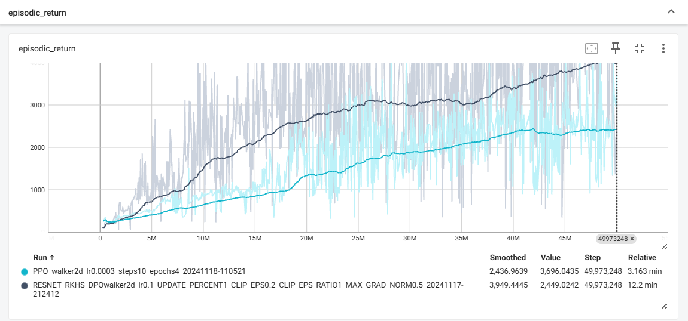

# Residual Kernel Policy Network (ResKPN): Enhancing Stability and Robustness in RKHS-Based Reinforcement Learning

This repository contains the implementation of the algorithms proposed in our paper: **Residual Kernel Policy Network: Enhancing Stability and Robustness in RKHS-Based Reinforcement Learning**.

## Overview

The **Residual Kernel Policy Network (ResKPN)** is a novel framework designed to improve the stability and robustness of reinforcement learning methods in Reproducing Kernel Hilbert Spaces (RKHS). This repository provides the codebase for reproducing the experiments and comparing ResKPN with other algorithms.

## Installation

This project builds upon the [PureJaxRL](https://github.com/luchris429/purejaxrl) framework. To set up the environment, use the `requirements.txt` file:

```bash
pip install -r requirements.txt
```

## Using JAX with Accelerators

JAX's ability to leverage accelerators (e.g., GPU/TPU) is crucial for efficient parallel training of environments. For detailed installation instructions and configurations, refer to the [Jax installation](https://github.com/jax-ml/jax#installation).

## Example Usage

### Running Algorithms

To run an algorithm, simply execute the corresponding Python script. For example, to train using the ResKPN algorithm, use:

```bash
python ResKPN.py
```

To record the training process, set `config["DEBUG"] = True`. Training logs will be saved in the logs directory and can be visualized using TensorBoard.

To visualize the training process, run

```bash
tensorboard --logdir logs
```

Here is an example visualization comparing PPO and ResKPN in the Walker2D environment:

